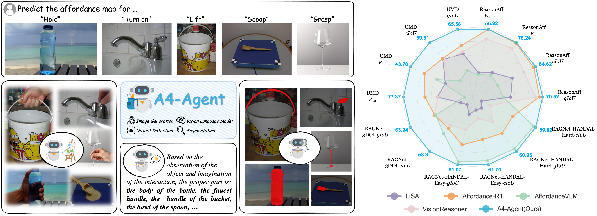

# A4-Agent: An Agentic Framework for Zero-Shot Affordance Reasoning

[](https://arxiv.org/abs/2510.09507) [](https://zixinzhang02.github.io/A4-Agent-page/)

[Zixin Zhang](https://scholar.google.com/citations?user=BbZ0mwoAAAAJ&hl=zh-CN)<sup>1,4*</sup>,
[Kanghao Chen](https://khao123.github.io/)<sup>1,4*</sup>,
[Hanqing Wang](https://hq-king.github.io/)<sup>1*</sup>,
[Hongfei Zhang](https://github.com/soyouthinkyoucantell)<sup>1</sup>,
[Harold Haodong Chen](https://haroldchen19.github.io/)<sup>1,4*</sup>,
[Chenfei Liao](https://chenfei-liao.github.io/)<sup>1,3</sup>,
[Litao Guo](https://scholar.google.com/citations?hl=zh-CN&user=efdm760AAAAJ)<sup>1</sup>,
[Ying-Cong Chen](https://www.yingcong.me/)<sup>1,2&#9993;</sup>

<span class="author-block"><sup>1</sup>HKUST(GZ)</span>
<span class="author-block"><sup>2</sup>HKUST</span>
<span class="author-block"><sup>2</sup>SJTU</span>
<span class="author-block"><sup>4</sup>Knowin</span><br>
<span class="author-block">
    <sup>*</sup>Equal contribution.
    <sup>&#9993;</sup>Corresponding author.
</span>




A4-Agent is an agentic framework designed for zero-shot affordance reasoning. Given an observed object, it integrates image generation, object detection, segmentation, and Vision-Language Models (VLMs) to imagine plausible interactions and localize action-specific parts. A4-Agent achieves state-of-the-art performance across multiple benchmarks in a **zero-shot** setting, outperforming baseline models specifically trained for affordance prediction tasks.

## 📰 News

* **[2025-12]** We release the code for A4-Agent. Arxiv paper is coming soon.

## Contents

* [Installation](#installation)
* [Inference on Your Own Custom Images](#inference-on-your-own-custom-images)
* [Inference on Benchmark Datasets](#inference-on-benchmark-datasets)
* [Acknowledgement](#acknowledgement)
* [Citation](#citation)

## Installation

### 1. Create a Conda Environment and Install PyTorch

```bash
conda create -n a4-agent python=3.11
conda activate a4-agent
pip install torch==2.5.1 torchvision==0.20.1 torchaudio==2.5.1 --index-url https://download.pytorch.org/whl/cu121
```

### 2. Install Flash Attention

Flash Attention is required for Rex-Omni. **We strongly recommend installing Flash Attention using a pre-built wheel** to avoid compilation issues.

You can find the pre-built wheel for your system [here](https://github.com/Dao-AILab/flash-attention/releases). For the environment setup above, use:

```bash
pip install https://github.com/Dao-AILab/flash-attention/releases/download/v2.7.4.post1/flash_attn-2.7.4.post1+cu12torch2.5cxx11abiFALSE-cp311-cp311-linux_x86_64.whl
pip install -r requirements.txt
```

### 3. Install Rex-Omni & SAM2

```bash
pip install git+https://github.com/IDEA-Research/Rex-Omni.git --no-deps
pip install git+https://github.com/facebookresearch/sam2.git
```

### 4. Download Models

You can manually download the models from Hugging Face using the commands below. If skipped, the script will attempt to download them automatically during the first run.

```bash
huggingface-cli download Qwen/Qwen2.5-VL-7B-Instruct
huggingface-cli download Qwen/Qwen-Image-Edit-2509
huggingface-cli download facebook/sam2.1-hiera-large
huggingface-cli download IDEA-Research/Rex-Omni
```

## Inference on Your Own Custom Images

### Option 1: Using Proprietary MLLMs as the `Thinker`

1. Set `API_BASE_URL` and `API_KEY` in your `.env` file (e.g., for OpenAI).
2. Run the demo:

```bash
python demo/demo.py --image-path /path/to/your/image --task-instruction "your task instruction" --model-name gpt-4o
```

### Option 2: Using Open-Source Qwen-2.5VL as the `Thinker`

1. Deploy the Qwen-2.5VL model to a local API server:

```bash
python inference/qwen_2_5vl_server.py
```

2. Set `QWEN_2_5_URL` in your `.env` file to your local server URL.
3. Start a new terminal and run the demo:

```bash
python demo/demo.py --image-path /path/to/your/image --task-instruction "your task instruction" --model-name qwen2.5vl-7b-instruct
```

## Inference on Benchmark Datasets

<details>
<summary>Click to view arguments for inference/agent.py</summary>

- `--resume`: Resume inference from where it left off.
- `--model-name`: The model name to use (default: "gpt-4o-11-7").
- `--dataset-type`: **(Required)** The dataset type ("UMD", "3DOI").
- `--dataset-path`: **(Required)** Path to the dataset directory.
- `--api-url`: API server URL. Defaults to `API_BASE_URL` or `QWEN_2_5_URL` from env vars.
- `--api-key`: API key. Defaults to `API_KEY` from env vars.
- `--use-dreamer`: Enable the "Dreamer" module to generate an imagined image using Qwen Image Edit Pipeline before reasoning.

</details>

### Option 1: Using Proprietary MLLMs

Configure `API_BASE_URL` and `API_KEY` in `.env`, then run:

```bash
python inference/agent.py --dataset-type UMD --dataset-path /path/to/UMD --model-name gpt-4o --resume
```

### Option 2: Using Open-Source Qwen-2.5VL

1. Start the server:

```bash
python inference/qwen_2_5vl_server.py
```

2. Configure `QWEN_2_5_URL` in `.env`, then start a new terminal and run:

```bash
python inference/agent.py --dataset-type UMD --dataset-path /path/to/UMD --model-name qwen2.5vl-7b-instruct --resume
```

## Acknowledgement
* [RAGNet](https://github.com/wudongming97/AffordanceNet) - We follow their implementation to test the performance on the RAGNet dataset.
* [Affordance-R1](https://github.com/hq-King/Affordance-R1) - We follow their implementation to test the performance on the UMD dataset and 
ReasonAff Dataset.

## Citation

If you find this work helpful, please cite:

```bibtex

```
